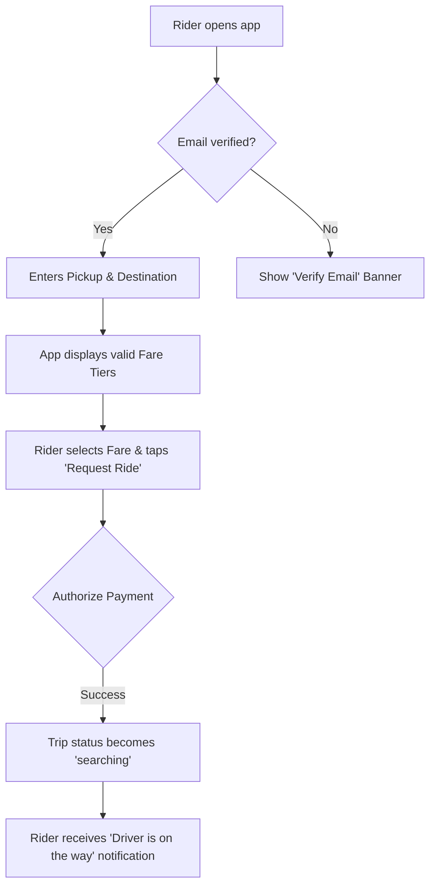
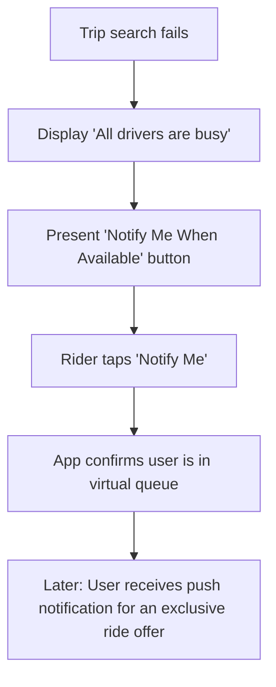

# Excursion Rides Full-Stack Architecture Document

## 1. Introduction

This document outlines the complete fullstack architecture for the Excursion Rides PWA, including backend systems, frontend implementation, and their integration. It serves as the single source of truth for AI-driven development.

* **Project Type**: Greenfield project built from scratch on the Next.js framework.
* **Architectural Goal**: To create a scalable, maintainable, and secure platform by leveraging a modern, serverless-first tech stack.

---

## 2. High-Level Architecture

* **Technical Summary**: A modern, full-stack Progressive Web App (PWA) built on the Next.js framework, managed within a monorepo, and deployed on the Vercel platform. The system uses Supabase as a unified backend (Database, Auth, Realtime) and integrates with essential third-party services like Stripe for payments, Google Maps for location services, and Firebase Cloud Messaging for push notifications.
* **Architectural Patterns**: Serverless Architecture, Utility-First Styling (Tailwind CSS), Repository Pattern for data access, and a Service Layer Pattern for API communication.
* **Diagram**:
    ```mermaid
    graph TD
        subgraph "User's Device"
            A[User Browser]
        end
    
        subgraph "Vercel Platform"
            B[Next.js PWA Frontend]
            C[Serverless API - Next.js API Routes]
        end
    
        subgraph "Third-Party Services"
            D[Supabase Platform (DB, Auth, Realtime)]
            E[Google Maps API]
            F[Stripe API]
            G[Firebase Cloud Messaging]
        end
    
        A -- Interacts with --> B
        B -- Calls API --> C
        C -- Reads/Writes --> D
        C -- Fetches Map Data --> E
        C -- Processes Payments --> F
        C -- Sends Push Notifications via --> G
    ```

---

## 3. Tech Stack

| Category                 | Technology                                | Version         | Purpose                                        |
| :----------------------- | :---------------------------------------- | :-------------- | :--------------------------------------------- |
| **Frontend Language** | TypeScript                                | `~5.4`          | Type-safe frontend development                 |
| **Frontend Framework** | Next.js                                   | `~14.2`         | PWA, UI, and API rendering                     |
| **UI Library** | shadcn/ui                                 | N/A             | Foundational, accessible UI components         |
| **Styling** | Tailwind CSS                              | `~3.4`          | Utility-first CSS framework for styling.       |
| **State Management** | Zustand                                   | `~4.5`          | Simple, scalable client-side state management. |
| **Form Handling** | React Hook Form & Zod                     | `~7.x` & `~3.x` | Building and validating forms.                 |
| **Backend Language** | TypeScript                                | `~5.4`          | Type-safe backend development in a monorepo.   |
| **Backend Framework** | Next.js API Routes & Supabase Edge Functions| `~14.2`         | Serverless backend API logic.                  |
| **Database** | Supabase PostgreSQL                       | `16`            | Primary data store.                            |
| **Database Access** | @supabase/supabase-js                     | `~2.x`          | Type-safe database access client.              |
| **Authentication** | Supabase Auth                             | `~2.x`          | Handles user sign-in, social logins, and sessions. |
| **Email Service** | Supabase Auth built-in                    | N/A             | Email verification and notifications.          |
| **Push Notifications** | Firebase Cloud Messaging                  | `~9.x`          | Real-time push notifications for trip updates. |
| **Testing** | Jest/RTL & Playwright                     | `~29.7` & `~1.44`| Unit, Integration, and End-to-end testing.   |
| **Deployment** | Vercel                                    | N/A             | Hosting, CDN, and Serverless platform.         |

---

## 4. Data Models

This section defines the core data structures for the application. These TypeScript interfaces serve as a "single source of truth" for data shapes across both the frontend and backend.

* **User**: Represents a single person who has signed up.
* **DriverProfile**: Stores driver-specific information linked to a User.
* **Vehicle**: Stores the details of a driver's vehicle.
* **Trip**: Represents a single ride from request to completion.
* **FareTier**: Stores the fixed-price options for rides.
* **Rating**: Stores a rating given by one user to another.
* **Message**: Stores a single chat message sent during a trip.
* **RideOffer**: A temporary record for the "Notify Me" virtual queue.

---

## 5. Components & Services

This section defines the logical backend services, which will be implemented as serverless functions.

* **Authentication Service**: Handles user sign-up, login, and session management via Supabase Auth.
* **User & Profile Service**: Manages data for users, driver profiles, and vehicles.
* **Fares & Booking Service**: Calculates trip distance and returns valid fare tiers.
* **Trip Management Service**: Acts as the core state machine for a ride's lifecycle.
* **Matching Service**: Finds available drivers and manages the virtual queue.
* **Payment Service**: Handles all Stripe interactions for fares and tips.
* **Notification Service**: Manages sending push notifications via Firebase Cloud Messaging.
* **Driver Payouts Service**: Manages Stripe Connect onboarding and scheduled payouts.

---

## 6. External APIs

The application will integrate with the following essential third-party services:

* **Google Maps Platform API**: For address autocomplete, routing, and distance calculation.
* **Stripe API**: For processing payments and managing payment methods.
* **Stripe Connect API**: For onboarding drivers and handling payouts.
* **Firebase Cloud Messaging (FCM)**: For sending push notifications.

---

## 7. Core Workflows

This section visualizes the step-by-step sequence for critical processes.

### 7.1. Rider Books a Trip


### 7.2. "Notify Me" Flow (Virtual Queue)


---

## 8. REST API Specification

This specification uses the OpenAPI 3.0 standard and serves as the contract between the frontend and backend.

```yaml
openapi: 3.0.0
info:
  title: Excursion Rides API
  version: 1.0.0
  description: REST API for the Excursion Rides rideshare platform
servers:
  - url: /api
    description: Next.js API Routes
components:
  securitySchemes:
    sessionAuth:
      type: apiKey
      in: cookie
      name: supabase-auth-token
  schemas:
    User:
      type: object
      properties:
        id: { type: string }
        email: { type: string, format: email }
        name: { type: string }
    ErrorResponse:
      type: object
      properties:
        error: { type: string }
paths:
  /health:
    get:
      summary: System health check
      responses:
        "200":
          description: System is healthy.
  /auth/signup:
    post:
      summary: Create new user account
      requestBody:
        required: true
        content:
          application/json:
            schema:
              type: object
              required: [name, email, password]
              properties:
                name: { type: string }
                email: { type: string, format: email }
                password: { type: string, minLength: 8 }
      responses:
        "200":
          description: User created successfully.
  /payments/setup-intent:
    post:
      summary: Create Stripe Setup Intent
      security:
        - sessionAuth: []
      responses:
        "200":
          description: Setup intent created successfully.
          content:
            application/json:
              schema:
                type: object
                properties:
                  clientSecret: { type: string }
```

---

## 9. Database Schema

We will use the Prisma schema definition language as a single source of truth to generate the SQL migration scripts for our Supabase PostgreSQL database.

```prisma
generator client {
  provider = "prisma-client-js"
}

datasource db {
  provider  = "postgresql"
  url       = env("DATABASE_URL")
}

model User {
  id            String   @id @default(cuid())
  email         String   @unique
  name          String?
  // ... other fields
  driverProfile DriverProfile?
  ridesAsRider  Trip[]    @relation("RiderTrips")
  ridesAsDriver Trip[]    @relation("DriverTrips")
}

model DriverProfile {
  userId          String   @id
  isApproved      Boolean  @default(false)
  stripeAccountId String?  @unique
  user            User     @relation(fields: [userId], references: [id])
  vehicle         Vehicle?
}

model Vehicle {
  driverId     String @id
  make         String
  model        String
  licensePlate String @unique
  driver       DriverProfile @relation(fields: [driverId], references: [userId])
}

model Trip {
  id        String   @id @default(cuid())
  riderId   String
  driverId  String?
  status    String
  rider     User     @relation("RiderTrips", fields: [riderId], references: [id])
  driver    User?    @relation("DriverTrips", fields: [driverId], references: [id])
}
// ... other models
```

---

## 10. Source Tree & Frontend Architecture

This section details the frontend-specific architecture, including folder structure, component design, state management, and more.

### 10.1. Project Structure
```plaintext
excursion-rides/
├── app/
│   ├── (auth)/                # Group for authentication routes
│   ├── (main)/                # Group for main protected app routes
│   ├── api/                   # Backend API routes
│   └── layout.tsx             # Root layout
├── components/
│   ├── ui/                    # Base components from shadcn/ui
│   └── shared/                # Custom composed components
├── lib/
│   ├── supabase/              # Supabase client and helpers
│   ├── stores/                # Zustand state management stores
│   ├── services/              # API service modules
│   └── utils.ts               # Shared utility functions
└── tailwind.config.ts         # Tailwind CSS configuration
```

### 10.2. Component Standards
* **Component Files**: Must use **PascalCase** (e.g., `BookingWidget.tsx`).
* **Hook Files**: Must use **camelCase** with a `use` prefix (e.g., `useCurrentUser.ts`).

### 10.3. State Management
We will use Zustand for its simplicity. Stores will be organized in `lib/stores/` and follow a standard template defining state and actions with TypeScript.

### 10.4. API Integration
A centralized API client will handle auth headers and base URLs. Feature-specific service modules (e.g., `tripService`) will use this client, separating data-fetching logic from UI components.

### 10.5. Routing & Styling
* **Routing**: Next.js App Router with a central `middleware.ts` for route protection.
* **Styling**: Tailwind CSS with brand colors defined as CSS Custom Properties in `globals.css`.

### 10.6. Testing & Environment
* **Testing**: A Testing Pyramid approach with Jest/RTL for unit tests and Playwright for E2E tests.
* **Environment**: Variables managed via `.env` files and Vercel, with a strict separation between public (`NEXT_PUBLIC_`) and server-side secrets.

---

## 11. Infrastructure, Security, and Standards

* **Deployment**: A GitOps workflow where the `main` branch deploys to production via Vercel. Pull requests create isolated preview environments.
* **Error Handling**: A layered strategy with structured JSON error responses, robust logging, and retry/circuit-breaker patterns for external APIs.
* **Security**: A defense-in-depth approach using secure `HttpOnly` cookies, server-side validation, rate limiting, and Supabase Row Level Security (RLS).
* **Coding Standards**: Mandatory rules including shared types for type safety, use of the Repository Pattern for data access, and secure handling of environment variables.